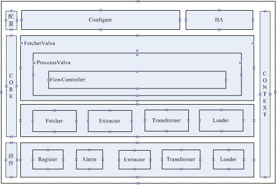

[TOC]

# Record 系统概述

## 一、目的

记录变更信息与业务系统解耦，接入简单，易于扩展、高可用、高并发。

## 二、工作原理

Record通过Canel 以slave的方式同步Mysql的binlog日志并且以并发的方式将数据进行拉取、抽取、转换，最终以串行的方式进行持久化操作。

    

## 三、架构

Record 大致可分为配置、HA、Core、Context、插件五大模块。配置模块负责节点、管道配置项的解析和校验；HA模块负责节点主备选举和切换；Core模块负责数据流控制、流转、同步确认、回滚、告警处理；Context模块负责插件、管道、告警、配置上下文管理。

    

## 四、配置

### 4.1 节点配置

|配置名称|配置参数|说明|
| :---: | :---: | :---: |
|节点组名|	node.group|	可用于环境区分，必填|
|节点编号|	node.id|	同一分组的节点编号必须唯一|
|注册插件名|	node.register|	用于HA和元数据存储，必填|
|线程池大小|	node.pool.size|	选填，默认值为10|
|告警插件名|	node.alarm.name|必填|
|管道编号|	pipline.id|	多个管道以“，”分隔，必须为整形且必填|

### 4.2 管道配置

piplineId是节点配置项pipline.id中的值,不同的管道均需要有对应的一套管道配置。

|配置名称|配置参数|说明|
| :---: | :---: | :---: |
|	|pipline.{piplineId}.canal.id||	
|	|pipline. {piplineId}.client.id||	
|	|pipline. {piplineId}.cluster.id||	
|	|pipline. {piplineId}.slave.id	||
|	|pipline. {piplineId}.destination||	
|	|pipline. {piplineId}.slave.filter||	
|	|pipline. {piplineId}.batch.size||	
|数据库地址|	pipline.{piplineId}.db.host|	必填|
|数据库端口|	pipline.{piplineId}.db.port|	必填|
|数据库用户名|	pipline.{piplineId}.db.username|	必填|
|数据库密码|	pipline.{piplineId}.db.password|	必填|
|Zk地址|	pipline.{piplineId}.zk.address|	必填,canal中zk地址|
|extractor插件名称|	pipline.{piplineId}.extractor|	必填|
|extractor 抽取规则|	pipline.{piplineId}.extractor.rule|	必填|
|transformer 名称|	pipline.{piplineId}.transformer|	必填|
|transformer 规则|	pipline.{piplineId}.transformer.rule|	必填,用于分库|
|loader 名称|	pipline. {piplineId}.loader|	必填|

### 4.3 插件配置

插件的配置文件位于配置文件 ext/{插件}/{插件名}/{插件名}.properties。

#### 4.3.1 ES插件配置

|配置名称|配置参数|说明|
| :---: | :---: | :---: |
|ES集群名|	es.cluster.name|	必填|
|ES集群地址|	es.cluster.address|	必填|

#### 4.3.2 Zookeeper(Register插件)配置

|配置名称|配置参数|说明|
| :---: | :---: | :---: |
|Zk地址|zk.address|必填|
|连接超时时间|zk.conn.timeout|必填|
|会话超时时间|zk.session.timeout|必填|

### 4.4 抽取规则

* <b>范式：</b>[库名|前缀*].\[表名 \(字段名:Boolean or * \)[|表名 \(字段名:Boolean or * \)*]\]

* <b>说明：</b>范式中的字段名后的Boolean表示更新对比时是否忽略该字段，譬如更新时间、更新人等无重要意义的字段

## 五、插件

由图4.1整体架构可以知道Register、Alarm、Extractor、Transform、Loader是基于插件实现的。如果插件需要其他实现方式，可以根据一些规则进行拓展：

* 实现对应插件接口方法；

* 在实现类上添加Plugin注解并命名（同一插件不能有相同名称）；

* 插件配置文件统一放在ext目录下，建议目录结构为：ext/{插件}/{插件名}/{插件名}.properties;
